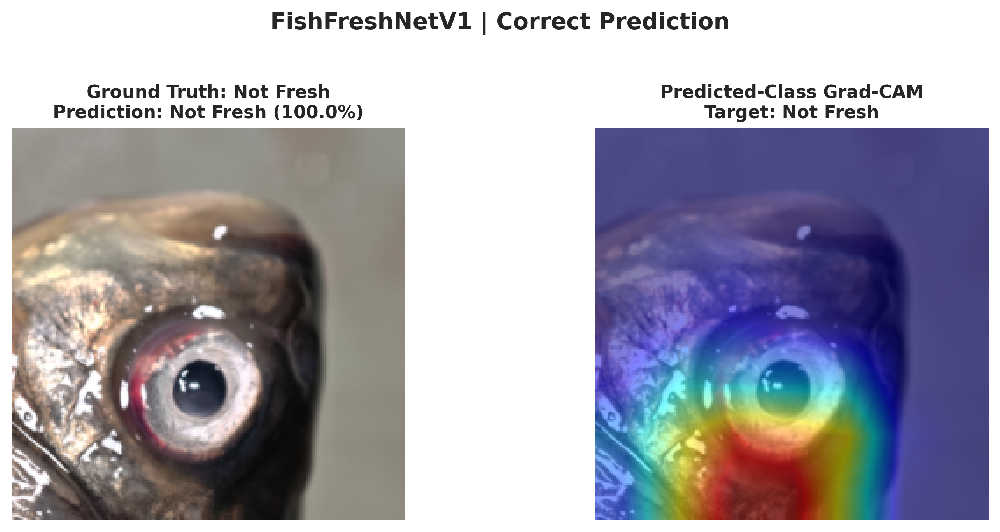
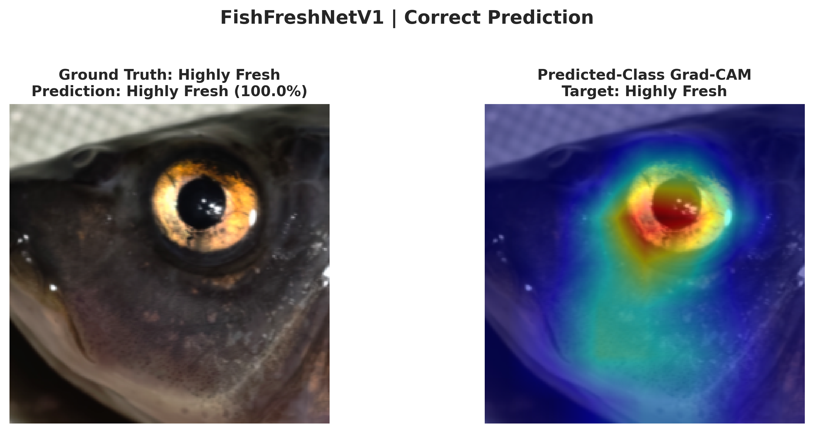
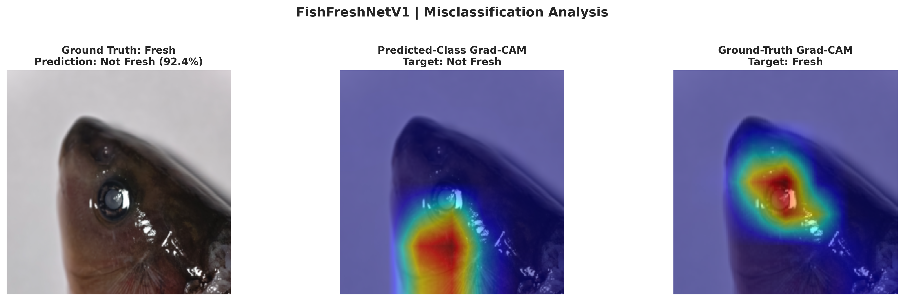

# FishFreshNetV1

Lightweight and explainable fish freshness assessment from fish-eye images.

FishFreshNetV1 uses an ImageNet-pretrained EfficientNet-B0 backbone with a Convolutional Block Attention Module (CBAM) to classify fish-eye images into three freshness stages: **Highly Fresh**, **Fresh**, and **Not Fresh**. The project is aligned with the paper *FishFreshNetV1: A Lightweight and Explainable Framework Based on Attention Mechanism for Fish Freshness Assessment*.

<p align="center">
  
</p>

## Highlights

| Item | Description |
| --- | --- |
| Task | Fine-grained fish freshness classification from fish-eye images |
| Model | EfficientNet-B0 + CBAM + adaptive average pooling + dropout classifier |
| Input size | 224 x 224 RGB images |
| Classes | Highly Fresh, Fresh, Not Fresh |
| Training split | 70% train, 20% validation, 10% test |
| Repeated runs | 5 independent splits seeded from 42 |
| Reported MFED accuracy | 99.23% |
| Reported complexity | 4.22M parameters, 0.41G FLOPs |

## Dataset

The experiments use the **Multistage Fish Eyes Dataset (MFED)**:

- Dataset page: https://data.mendeley.com/datasets/67nmx3mhwh/2
- DOI: `10.17632/67nmx3mhwh.2`
- License: CC BY 4.0
- Total images: 4,800
- Class balance: 1,600 images per freshness class
- Species: rice flower fish and crucian carp
- Acquisition: six days of storage at 4 degrees C, four lighting/background settings, left and right eyes, five shooting angles

<p align="center">
  
</p>

Expected dataset layout:

```text
MFED/
  Highly Fresh/
  Fresh/
  Not Fresh/
```

## Training

Install dependencies:

```bash
pip install -r requirements.txt
```

Train FishFreshNetV1:

```bash
python FishFreshNetV1.py --data-dir /path/to/MFED
```

Useful options:

```bash
python FishFreshNetV1.py \
  --data-dir /path/to/MFED \
  --output-dir runs/fishfreshnet_v1 \
  --epochs 50 \
  --batch-size 64 \
  --learning-rate 1e-4 \
  --runs 5
```

The training script saves per-run checkpoints, learning curves, confusion matrices, and CSV metrics under `runs/fishfreshnet_v1/`. Model weights and run outputs are intentionally ignored by git.

## Results Reported In The Paper

| Model | Params / M | FLOPs / G | MFED Acc / % | MFED Pr / % | MFED Re / % | MFED F1 / % | FFE Acc / % |
| --- | ---: | ---: | ---: | ---: | ---: | ---: | ---: |
| VGG16 | 134.27 | 15.47 | 98.08 | 98.03 | 98.13 | 98.07 | 77.40 |
| ResNet18 | 11.18 | 1.82 | 98.67 | 98.66 | 98.67 | 98.66 | 79.36 |
| MobileNetV2 | 2.23 | 0.33 | 98.54 | 98.54 | 98.54 | 98.53 | 79.59 |
| EfficientNet-B0 | 4.01 | 0.41 | 98.96 | 99.00 | 98.91 | 98.95 | 81.64 |
| **FishFreshNetV1** | **4.22** | **0.41** | **99.23** | **99.20** | **99.22** | **99.21** | **81.78** |

## Explainability

Grad-CAM visualizations show that successful predictions usually focus on the pupil and cornea, while failed cases may be distracted by specular highlights or bright scales near the eye.

| Correct example | Correct example | Failure example |
| --- | --- | --- |
|  |  |  |

## Repository Layout

```text
FishFreshNetV1.py          # Clean training entry point
fishfreshnet/
  data.py                  # MFED transforms, class order, split and dataloaders
  models.py                # EfficientNet-B0 + CBAM model definition
  train.py                 # Training, evaluation, metrics and plots
assets/                    # README figures and Grad-CAM examples
requirements.txt
```

The paper manuscript and pretrained weights are not included in the public repository.
